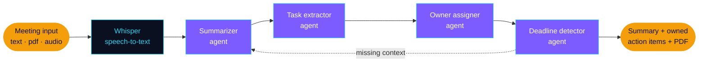

 

---

## About

AI graduate from the **Egyptian Russian University**, now building **agentic systems** — LLMs that read a request, choose a tool, run it, and come back with something finished. Before the agents, the same instinct in classic ML: clean the data, train the model, then actually ship it as an app someone can open.

- 🤖 **Agents & LLMs** — LangChain, LangGraph, tool calling, output parsing, RAG
- 🧠 **Deep learning** — CNNs and RNNs in TensorFlow, Keras, PyTorch
- 📊 **Data** — cleaning, analysis, visualization, and modelling in Python
- 🚀 **Shipping** — Streamlit apps, API integrations, error handling and retries
- 💬 Ask me about **agent design, RAG pipelines, or getting an LLM to behave**

🎯 Open to **AI / ML** and **Data Science** roles — remote or Cairo-based.

---

## How I build

Every project below is a version of this loop. Here it is as it runs in my meeting assistant:

Four agents, one shared state, and a loop back when something is missing — not a single prompt pretending to be a product.

---

## Projects

<table>
<tr>
<td width="50%" valign="top">

### 📝 [Multi-Agent Meeting Assistant](https://github.com/AmrrXI/multi-agent-productivity-assistant)

Four LangGraph agents turn a raw meeting — text, PDF, or audio — into a summary, action items **assigned to the right owner**, and detected deadlines. Whisper handles the audio, and the whole thing exports as a PDF report.

**The hard part:** keeping four agents on one shared state without them overwriting each other.

   

</td>
<td width="50%" valign="top">

### 🤖 [LLM-Agent-Toolkit](https://github.com/AmrrXI/LLM-Agent-Toolkit)

An agent that reads a request, selects the right tool, and executes it — scheduling, location lookups, analytics. A rule-based fallback catches the cases the model isn't sure about, so it never dead-ends on the user.

**The hard part:** validating tool arguments with Pydantic before anything runs.

   

</td>
</tr>
<tr>
<td width="50%" valign="top">

### ⚽ [Football Knowledge Assistant](https://github.com/AmrrXI/Football-Knowledge-Assistant)

A RAG chatbot over a custom football knowledge base, with conversational memory — so "and who did he play for before that?" still knows who *he* is.

**The hard part:** chunking the knowledge base so retrieval returns the answer, not just the topic.

  

</td>
<td width="50%" valign="top">

### ✉️ [AI Email Assistant](https://github.com/AmrrXI?tab=repositories)

An LLM pipeline that drafts professional replies and then handles the boring half — formatting, sending, saving, logging — through API-style functions with retries and proper error handling.

**The hard part:** failing gracefully. An agent that half-sends an email is worse than one that stops.

  

</td>
</tr>
<tr>
<td width="50%" valign="top">

### 📄 [HireHub — Applicant Tracking System](https://github.com/AmrrXI/ATS-using-Streamlit)

🎓 **Graduation project · Grade A · Team leader**

Parses CVs with NLP, scores them against a job description, and ranks the shortlist — so a hiring team reads five CVs instead of five hundred.

**The hard part:** ranking that survives messy, inconsistent CV formatting.

  

</td>
<td width="50%" valign="top">

### 💬 [Sentiment Analysis](https://github.com/AmrrXI/Sentiment-Analysis)

Sentiment and emotion classification over text, with the full preprocessing pipeline — tokenization, cleaning, normalization — and results visualized rather than printed.

**The hard part:** preprocessing that keeps the signal negation and sarcasm carry.

  

</td>
</tr>
</table>

🔐 Also: [**Image Steganography**](https://github.com/AmrrXI/Image-Steganography) — hide and recover messages inside images, wrapped in a small Tkinter desktop app.

---

## Toolbox

<table>
<tr>
<td><b>Agentic AI & LLMs</b></td>
<td>

</td>
</tr>
<tr>
<td><b>ML & Deep Learning</b></td>
<td>

</td>
</tr>
<tr>
<td><b>Data & Analysis</b></td>
<td>

</td>
</tr>
<tr>
<td><b>Ship & Collaborate</b></td>
<td>

</td>
</tr>
</table>

---

## Training & credentials

Most recent first — the newer entries are where the agent work comes from.

| | Programme | Where | Focus |
|:--|:--|:--|:--|
| **Aug 2026** | AI & Technology | iCareer | AI-assisted workflows, Claude Code, task automation, Agile/Scrum, Jira, Git |
| **Jul 2026** | AI Agent Development | Digital Hub × Orange Digital Center | LLMs, LangChain, prompt engineering, agents, tool calling, API integration |
| **Sep 2024** | AI Practitioner Certificate | IBM | Hands-on ML, NLP and deep learning via Watson Studio |
| **Mar 2024** | ML Methods & Tools | IBM | Key algorithms applied to real-world datasets |
| **Mar 2024** | Fundamentals of AI | IBM | Core AI concepts and principles |
| **Sep 2023** | Artificial Intelligence | ITI × Arab Academy | AI basics, ML, DL, data science, Python |

🎓 **BSc Artificial Intelligence** — Egyptian Russian University, 2020–2024
🗣️ Arabic native · English upper-intermediate · Russian beginner

---

## The numbers

---

## Watch the snake eat my commits

<picture>
  <source media="(prefers-color-scheme: dark)" srcset="https://raw.githubusercontent.com/AmrrXI/AmrrXI/output/github-snake-dark.svg" />
  <source media="(prefers-color-scheme: light)" srcset="https://raw.githubusercontent.com/AmrrXI/AmrrXI/output/github-snake.svg" />
  
</picture>

---

### Let's build something

I'm looking for **AI / ML** and **Data Science** work — and I'm happy to talk through an agent architecture with anyone who's stuck on one.

`amrrtamerr@hotmail.com` · +20 128 813 4755 · New Cairo, Egypt

